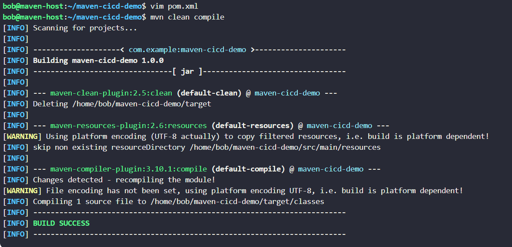
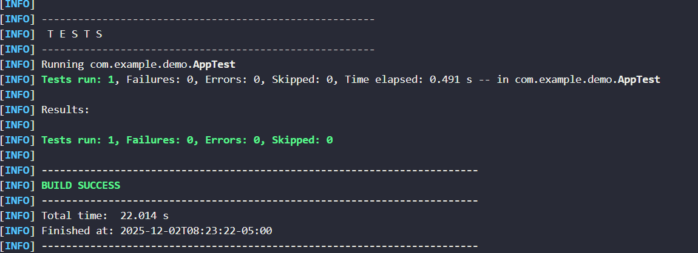
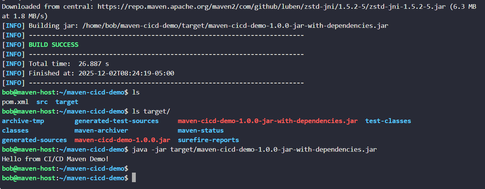

```markdown
# 📌 Maven CI/CD Demo Project

This repository contains a simple **Java 11 application built with Maven**.  
It is designed as a starting point for CI/CD automation using platforms like **Harness, Jenkins, GitHub Actions, GitLab CI, ArgoCD, etc.**

---

## 📁 Project Structure

```

maven-cicd-demo/
├── src
│   ├── main
│   │   └── java/com/example/demo/App.java
│   └── test
│       └── java/com/example/demo/AppTest.java
└── pom.xml

````

---

## 🚀 Step-by-Step Setup (Manual Build)

### 1️⃣ Create project directories
```bash
mkdir -p maven-cicd-demo/src/main/java/com/example/demo
mkdir -p maven-cicd-demo/src/test/java/com/example/demo
````

### 2️⃣ Create Java source file

```bash
vim maven-cicd-demo/src/main/java/com/example/demo/App.java
```

### 3️⃣ Create Java test file

```bash
vim maven-cicd-demo/src/test/java/com/example/demo/AppTest.java
```

### 4️⃣ Create Maven configuration file

```bash
vim maven-cicd-demo/pom.xml
```

### 5️⃣ Move inside project folder

```bash
cd maven-cicd-demo/
```

---

## 🧪 Build & Run the Project

### 🔹 Compile the project

```bash
mvn clean compile
```



### 🔹 Check Maven version

```bash
mvn -version
```

### 🔹 Rebuild after updating `pom.xml` (if needed)

```bash
vim pom.xml
mvn clean compile
```

### 🔹 Run tests

```bash
mvn test
```


### 🔹 Create executable JAR

```bash
mvn package
```


### 🔹 Verify generated output

```bash
ls
ls target/
```

### 🔹 Run the application

```bash
java -jar target/maven-cicd-demo-1.0.0-jar-with-dependencies.jar
```

---


